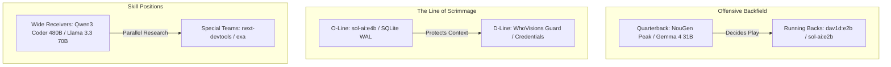

# 🏟️ NouGenAi Football Franchise: Model Roster & Positional Depth Chart

Dave is GM. The Razer Blade is the Stadium. Apollo is Coach. The Playbook is `GEMINI.md`. Here is the positional alignment of the active models across the gridiron:

---

## 🏈 The Offense (Logic, Execution & Speed)

### 🎯 Quarterback (QB) — Primary Builder & Decision Maker
*   **Active Starters**: `whovisions/nougen-player-3.7` (Cloud) / `google/gemma-4-31b-it:free` (Edge)
*   **Positional Role**: Owns complex codebase modifications, structural design decisions, and final logic generation. Translates Coach's plays into active execution steps. Includes **DavOs-class** autonomous reasoning.

### 🛡️ Offensive Line (O-Line) — Context Protection & Shard Caching
*   **Active Starters**: `sol-ai:e4b` (Local) / `NouGenShards` (SQLite+WAL)
*   **Positional Role**: Blocks token bloat. Prevents raw logs from flooding the active context window. Pre-filters inputs, indexes knowledge, and ensures quick FTS5/BM25 retrieval to shield the QB. Supports **Kaedra-class** (Verse) and **Rhea-class** (Moment) retrieval weights.

### 🏈 Wide Receivers (WR) — Parallel Research & Web Ingestion
*   **Active Starters**: `qwen/qwen-3-coder-480b-a35b:free` / `meta-llama/llama-3.3-70b-instruct:free`
*   **Positional Role**: Runs deep, high-speed routes to ingest academic preprints (arXiv), crawl documentations, and analyze parallel branches.

---

## 🛡️ The Defense (Security, Auditing & Resilience)

### 🛑 Defensive Line (D-Line) — Gatekeeping & Leak Protection
*   **Active Starters**: `whovisions_guard.py` / Local Security Hooks
*   **Positional Role**: Stops rate limits (`429`), authorization failures (`401/403`), and credential leaks. Intercepts outgoing requests to ensure all keys are masked and queries are routed optimally.

### 🦅 Linebackers & Secondary (Safety) — Constitution Linters
*   **Active Starters**: `mesh_acceptance_test.ps1` / Local Liveness Monitors
*   **Positional Role**: Protects the system boundaries. Enforces strict compliance with `.gitignore` and locks the mutation gates unless explicit human approval is confirmed.

---

## 👟 Special Teams (Utility & Optimization)

### 🎯 Kicker / Punter — Diagnostic DevTools
*   **Active Starters**: `next-devtools-mcp` / `exa-search` / Image Generators
*   **Positional Role**: Deployed for targeted operations—rendering mockups, tracing component trees, or pulling specific search queries when the offense gets stuck.
