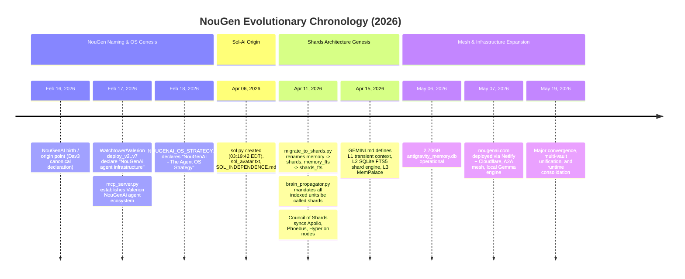

# 🏛️ NouGen Origin Chronology & Provenance Anchor

**Canonical Author:** Dave Meralus (Dav3 / Superdave Houdini) / Who Visions LLC  
**Classification:** Fleet Origin Canon (Signed by Operator)  
**Status:** Locked Truth  

---

## Executive Summary: Dual-Birth Distinction

A critical architectural distinction separates **NouGen's Naming & Agent OS Birth** from the **Shards Storage & Memory Architecture Birth**, confirmed directly by Dave (GM):

---

## 1. Phase I: NouGen Naming & Agent OS Genesis (February 16–18, 2026)
- **February 16, 2026**:
  - **NouGenAI Birth & Origin Point** as canonically established by Dave Meralus.
  - The conceptual and architectural inception of NouGenAI.
  - Memory persistence existed prior to Shards using relational databases and structured state.
- **February 17, 2026**:
  - `Watchtower/Valerion` deployment manifests (`deploy_v2.py` through `deploy_v7.py`) formally document the platform as `NouGenAi agent infrastructure`.
  - `mcp_server.py` in Valerion identifies itself as the *Valerion NouGenAi Agent Ecosystem*.
- **February 18, 2026**:
  - `docs/NOUGENAI_OS_STRATEGY.md` is authored, establishing the doctrine:
    > "NouGenAI - The Agent OS Strategy: NouGenAI is the OS."
  - This marks the formal operationalization of the NouGen platform.

---

## 2. Phase II: Sol-Ai Origin (April 6, 2026)
- **April 6, 2026**:
  - `sol.py` created at `03:19:42 EDT` (SHA-256 baseline `22d73c28...`).
  - `sol_avatar.txt` created at `04:27:34 EDT`.
  - `sol_logic.json` created at `09:38:47 EDT`.
  - `SOL_INDEPENDENCE.md` authored at `10:00:43 EDT`.
  - Establishes the player model and local autonomous cognitive loop.

---

## 3. Phase III: Shards Storage & Council Architecture Genesis (April 11–15, 2026)
- **April 11, 2026**:
  - The migration script `migrate_to_shards.py` executes the foundational nomenclature transformation:
    - `memory` table -> `shards`
    - `memory_fts` -> `shards_fts`
  - `brain_propagator.py` establishes the universal mandate: all indexed cognitive content across the federation must be formatted and addressed as **shards**.
  - **Council of Shards** is constituted, synchronizing state between `Apollo` (Blade), `Phoebus`, and `Hyperion`.
- **April 15, 2026**:
  - Standing `GEMINI.md` constitution codifies the 3-tier memory hierarchy:
    1. **L1**: Transient context window.
    2. **L2**: SQLite FTS5 shard engine (`shards.db`).
    3. **L3**: Persistent MemPalace archival tier.

---

## 4. Phase IV: Mesh Expansion & Convergence (May 2026)
- **May 6, 2026**:
  - Production database `antigravity_memory.db` reaches 2.70 GB of verified operational memory shards.
- **May 7, 2026**:
  - Public web domain `nougenai.com` goes live with Netlify frontend and Cloudflare Edge mesh.
  - Agent-to-Agent (A2A) protocol activated alongside local Gemma model routing.
- **May 19, 2026**:
  - **Convergence Day**: Major cross-fleet unification, multi-vault federation import, and runtime consolidation.
  - *Doctrinal Caveat*: May 19 is a major integration convergence date, **NOT** the initial birth of NouGen or Shards.

---

## 5. False-Friend Telemetry Warning (ArXiv Backfills)
- Background arXiv radar ingestion tasks (`arxiv_gap_backfill.py`, `arxiv_backfill_driver.py`) routinely append `NouGenAi-Orchestrator` audit metadata to ingested paper records.
- **Law of Provenance**: Ingestion timestamp footers reflect crawler runtimes, NOT repository or system origin dates. Origin analysis must rely strictly on repository commit graphs, filesystem `CreationTime`, and canonical doctrine records.
