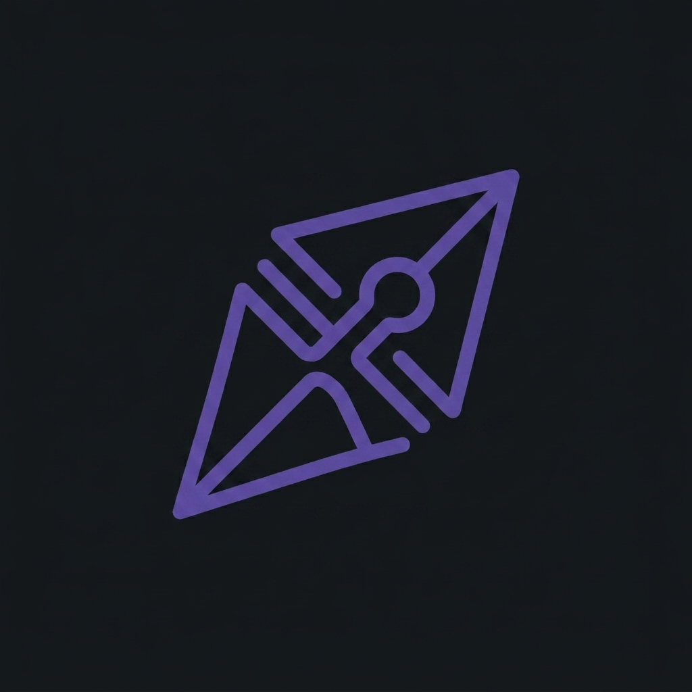
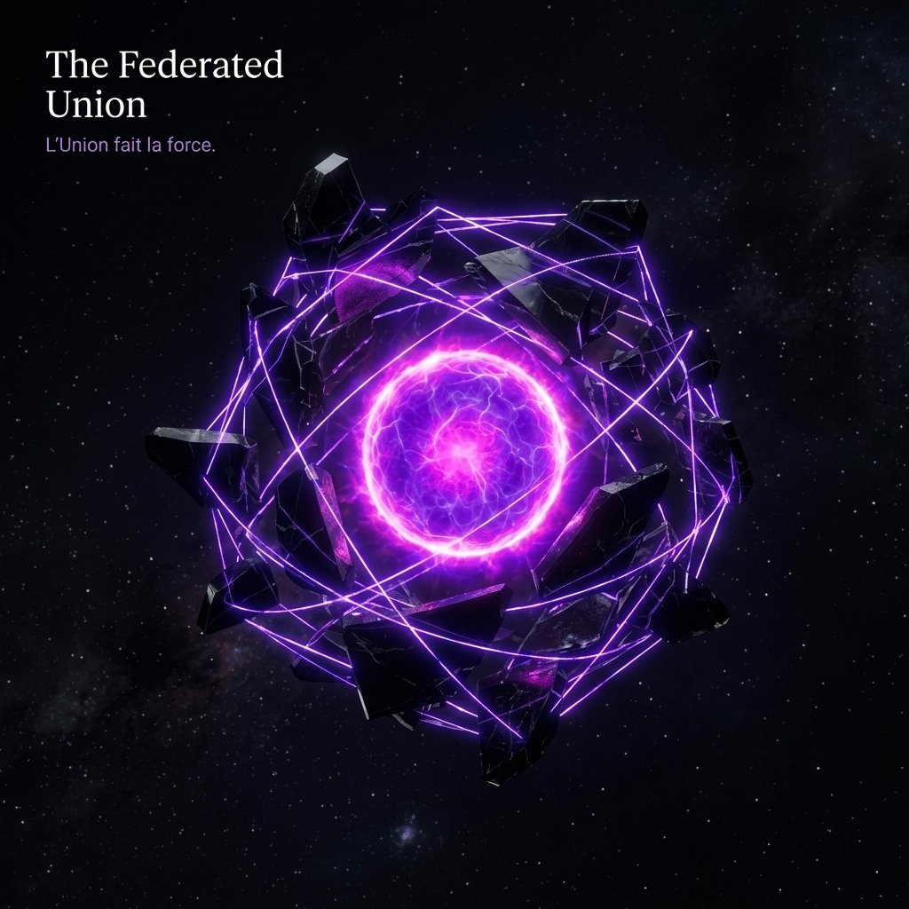
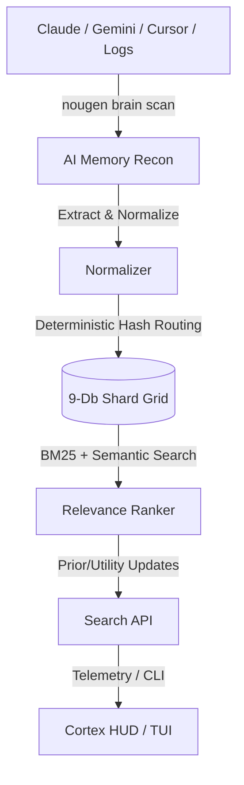
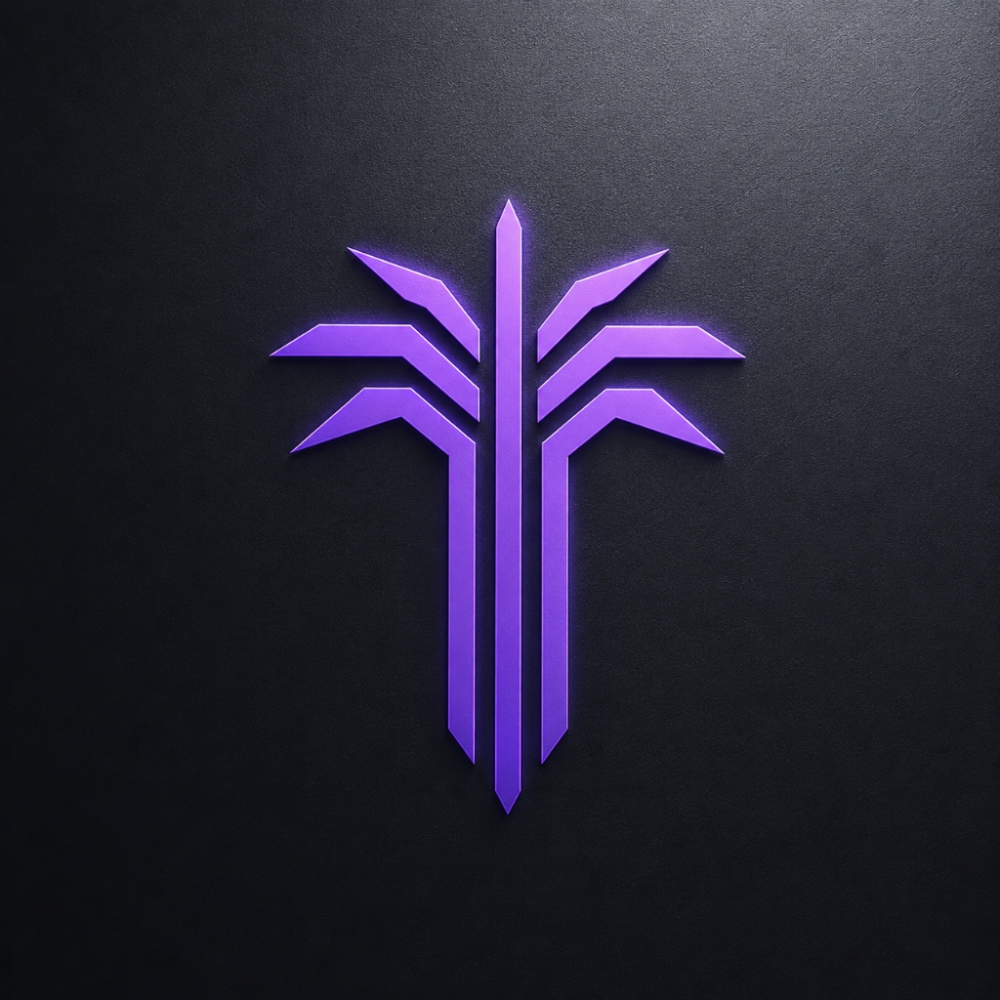
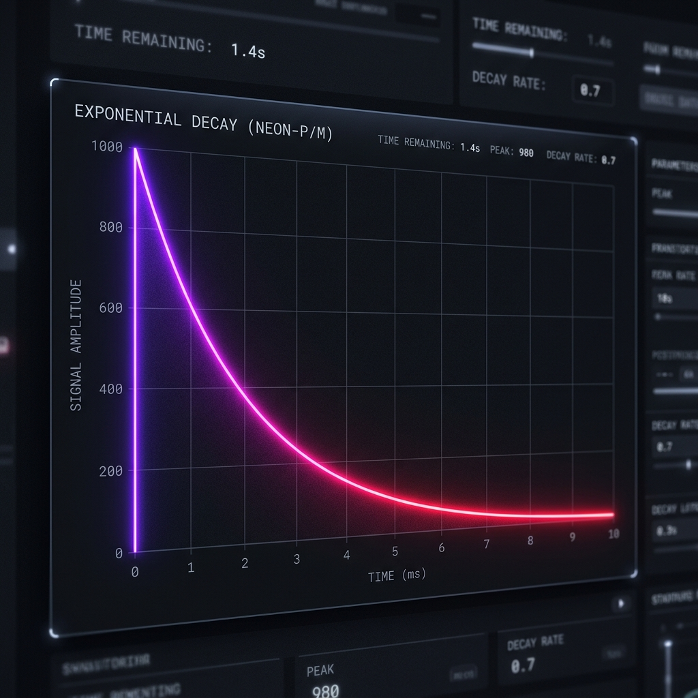
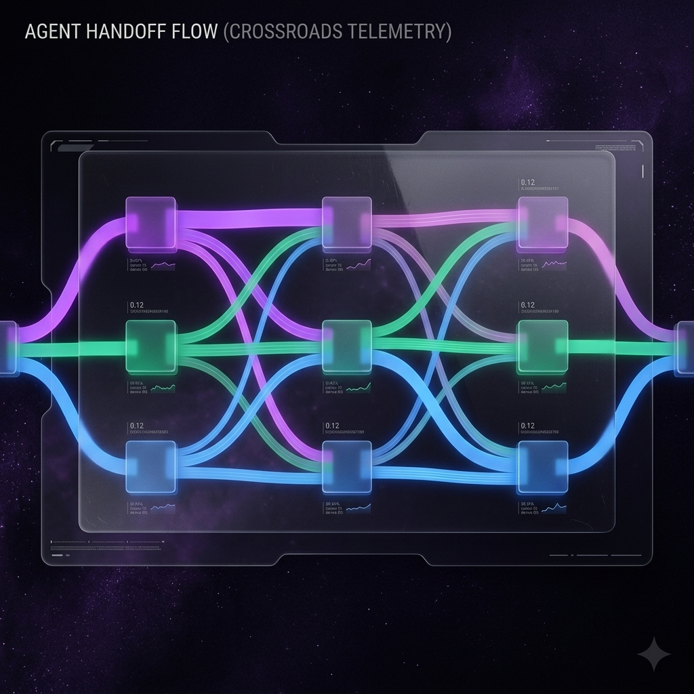
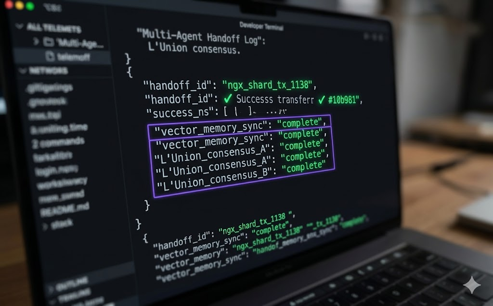

<p align="center">
  <picture>
    <source media="(prefers-color-scheme: dark)" srcset="docs/images/logo_dark.png">
    <source media="(prefers-color-scheme: light)" srcset="docs/images/logo_light.png">
    
  </picture>
</p>

<h1 align="center">🪩 NouGenShards</h1>

<p align="center">
  <strong>Persistent local memory for AI assistants — so your best fixes, decisions, and context don't disappear between tools.</strong>
</p>

<p align="center">
  <picture>
    <source media="(prefers-color-scheme: dark)" srcset="docs/images/federated_union_dark.png">
    <source media="(prefers-color-scheme: light)" srcset="docs/images/federated_union_light.png">
    
  </picture>
</p>

> **"Nou Gen"** means *"We have"* in Haitian Creole. NouGenShards means: **We have memory.**
> 🇭🇹 Built by **Who Visions** to empower global diaspora intelligence.

Every AI tool you use forgets when the session ends. NouGenShards scans your machine for scattered AI traces — Claude, Gemini, Cursor, Codex, and more — extracts the useful context, and stores it locally in encrypted SQLite databases you control. No cloud required.

> ⚠️ **Source-Available, Not Open Source**: This project is provided so users can inspect, learn, and trust the local client. Commercial reuse, redistribution for a fee, and competing hosted services are strictly prohibited. See [LICENSE.md](./LICENSE.md).

---

## 📖 CLI Workflow Example

```bash
# 1. Discover and import scattered AI history from Claude, Gemini, Cursor, etc.
$ nougen brain scan
Found:
✓ Claude (3,412 items)
✓ Gemini (1,209 items)
✓ Cursor (4,891 items)

# 2. Search your memory substrate semantically
$ nougen search "React auth bug" --semantic
[Shard #142] (8 months ago via Claude)
"Fixed JWT token expiration handler..."
```

---

## 🏗️ Architecture



---

## 🚀 Why NouGenShards?

<p align="center">
  <picture>
    <source media="(prefers-color-scheme: dark)" srcset="docs/images/palmis_logo_dark.jpg">
    <source media="(prefers-color-scheme: light)" srcset="docs/images/palmis_logo_light.png">
    
  </picture>
</p>

- **AI Memory Recon**: Run `nougen brain scan` to discover and import your fragmented AI history across 15+ known tool formats.
- **Cortex HUD**: See your memory grow — a 3x3 substrate map, high-velocity timelines, and a point-and-click shard browser. Ships as a native desktop app (Tauri) and web view.
- **Privacy First**: Your core memory stays on your machine in local SQLite databases. Secrets are redacted on import, and the credential vault encrypts values at rest. Cloud platforms forget, but local memory belongs to you.
- **Relevance ranking that learns**: Mark a shard as helpful and it ranks higher next time. Results are scored by a weighted blend of keyword match (BM25), semantic similarity, and your usefulness votes.

<p align="center">
  <picture>
    <source media="(prefers-color-scheme: dark)" srcset="docs/images/decay_curve_dark.png">
    <source media="(prefers-color-scheme: light)" srcset="docs/images/decay_curve_light.png">
    
  </picture>
</p>

- **One search across sources**: Search your local memory and any cloud nodes you connect. Results are merged into one ranked list.
- **Memory consolidation** *(experimental)*: The engine ages out stale memory over time so the most useful context stays on top.
- **Bring your own provider**: Route requests through OpenRouter with automatic fallback if a model is unavailable.
- **[How it works](docs/architecture.md)**: How the memory engine maps onto the code.

---

## 📦 Quick Start

### 1. Install

**Windows (One-Click)** 🪟
```bash
# Just run the launcher
nougen.bat
```

**Other Platforms** 🐍🟢
```bash
# Using Python
pip install .
```

### 1b. Desktop HUD (Tauri)

The Cortex HUD also ships as a native desktop app (Rust + Tauri v2, React frontend):

```bash
npm install          # frontend deps
npm run tauri dev    # live-reload development window
npm run tauri build  # production app at src-tauri/target/release/
```

Prerequisites: Node 20+, Rust toolchain (`winget install Rustlang.Rustup`), and
`npm i -g @tauri-apps/cli`. On first checkout run `tauri icon src-tauri/icons/icon.png`
to regenerate the platform icon binaries (they are not committed).
The HUD talks to the Python engine through Tauri commands (`search_shards`,
`engine_status`, `memory_stats`) that proxy the `nougen … --json` CLI contract.

### 2. Find Your AI Brain

```bash
# Discover local AI tool history
nougen brain scan

# Import history into your local memory (dry-run by default)
nougen brain import

# Write to the database
nougen brain import --confirm
```

### 3. Check Health

```bash
nougen doctor
```

---

## 💾 Core Workflow

### Capture Experience
```bash
nougen add "Fixed the N+1 query bug in the user controller" --tags rails,fix,performance
```

### Search Memory
```bash
nougen search "N+1 query" --semantic
```

### Close the Loop
```bash
# Tell the tool Shard #5 was helpful so it ranks higher next time
nougen mark 5 --worked
```

### Agent Handoffs

<p align="center">
  
</p>

Leave a structured note for the next coding agent when you transfer work between
sessions (Gemini, Claude, Codex, local models). Captures the goal, git state,
open tasks, and a free-text note. See **[docs/handoffs.md](docs/handoffs.md)** for
the full protocol, schema, and environment overrides.
```bash
# Outgoing agent records where it left off
nougen handoff create --goal "Wire the Tauri sidecar" --message "frontend done, rust stubbed"

# Incoming agent reviews the latest open handoff...
nougen handoff read

# ...then acknowledges it (the read-back that marks it picked up)
nougen handoff ack --message "picking this up"

# See history and which handoffs are still open
nougen handoff list
```

<p align="center">
  
</p>

---

## 🤖 Fleet Agent Roster

NouGenShards features a 10-agent roster (personas layered over the memory engine). These agents route through local models by default (providing $0 cloud cost execution) but support automatic fail-soft to OpenRouter Cloud or Who Visions Cloud (Ollama Cloud) depending on key availability:

- **Sharder**: Ingestion (Data Capture & Indexing) — Binds to `dav1d:e2b`.
- **Remember**: Recall (Memory Retrieval & Verification) — Binds to `sol-ai:e4b`.
- **Kronos**: Time (Temporal Grounding & Decay) — Binds to `gemma2:2b`.
- **DavOs**: Operations (Oversight & Gatekeeper) — Binds to `DavOs:latest`.
- **Sol-Ai**: Broad Reasoning & Illumination — Binds to `sol-ai:e4b`.
- **NouGen**: Orchestrator (Core Orchestration & Branding) — Binds to `gemma4:12b`.
- **Griot**: Rules (Semantic Synthesis & Consolidation) — Binds to `griot:e2b`.
- **Rhea**: Security (System Hardening & Audit) — Binds to `rhea-noir:e2b`.
- **Kaedra**: Pedagogy (Tensor Mathematics & Training) — Binds to `kaedra:e4b`.
- **Iris**: Airspace (Web Research & Browser Actuation) — Binds to `iris-ai:e4b`.

These personas run locally or seamlessly fall back to cloud providers depending on key configuration, offering hybrid processing.

---

## 🛡️ Griot — the Vault Keeper

**Griot** is NouGenShards' semantic-synthesis agent — the System-2 half of the dual-system memory. Named for both the West-African oral historian and Wakanda's GRIOT keeper-AI, it speaks only from the vault and carries the roster's Haitian Kreyòl lineage in its voice (e.g. *"Anghkooey"* — remember). Its lane is **compression of experience into truth**: it scans high-utility, unconsolidated shards and compiles them into permanent `{subject, predicate}` invariants in `semantic_knowledge`. It binds to the local `griot:e2b` model, with a deterministic regex fallback parser so the consolidation cycle never stalls on a missing GPU.

Griot is also a full conversational agent: it holds vault-grounded conversations, exposes a runtime tool registry for dynamic function calling, and is reachable by name over the agent-to-agent (A2A) bus.

### Verified consolidation

Consolidation is **verification-gated**: each extracted invariant is adversarially judged (LLM-as-judge) against its source shard before it is written to permanent semantic memory. The verifier **defaults to reject on uncertainty** — the guiding principle is that *an unsupported rule in permanent memory is worse than a missing one*, which is why every write is gated. When no model is reachable, verification is automatically a no-op (offline can't refute), so behavior stays deterministic in tests and on cold boxes.

`consolidate()` now returns three extra fields alongside its counts and `rules`:

- `verified` — bool, whether the adversarial verifier was active for this run.
- `rejected` — invariants that failed verification, each with a `reason`.
- `conflicts` — candidates that contradict an existing rule with the same subject.

**Contradiction detection.** `Griot.find_conflicts()` audits semantic memory for the same subject carrying conflicting predicates. It is exposed as the dynamic tool `find_conflicts` and the CLI command `nougen griot conflicts`.

### CLI

```bash
# Hold a vault-grounded conversation
nougen griot chat "What rules do we have about JWT auth?"

# Run the verification-gated consolidation loop (episodic → semantic)
nougen griot consolidate --limit 10

# Audit semantic memory for contradictions (same subject, conflicting rules)
nougen griot conflicts

# List compiled semantic invariants, optionally filtered by subject
nougen griot rules --subject "auth"

# Reach another roster agent over A2A
nougen griot ask Remember "what did we learn about the N+1 fix?"

# Inspect Griot's live tool registry
nougen griot tools
```

### Python

```python
from nougen_shards import griot, a2a

# Vault-grounded chat with dynamic function calling
reply = griot.get_default_griot().chat("Summarize our rules on caching")

# Talk to Griot over the A2A bus with an explicit intent
result = a2a.ask("NouGen", "Griot", "consolidate the vault", intent=a2a.CONSOLIDATE)
```

During chat, the model emits JSON actions — `{"tool": <name>, "args": {...}}` to call a tool, or `{"answer": "..."}` to respond. Built-in tools are `recall`, `list_rules`, `consolidate`, `ask_peer`, `capture`, and `find_conflicts`.

### Dynamic tool registration

Griot's capabilities are not fixed at construction. Register a closure on `griot.tools` at runtime and it becomes immediately invocable inside the chat loop:

```python
g = griot.get_default_griot()
g.tools.register(
    "today",
    lambda: "2026-06-28",
    description="Return today's date.",
)
```

A2A intents Griot understands are `chat` (default), `recall`, and `consolidate`.

### Reflexion & evals

**Reflexion self-critique.** `Griot.chat(message, reflect=True)` runs a self-critique pass over its draft answer: Griot reviews its own reply against the recalled vault context, corrects anything ungrounded or invented, and keeps its Kreyòl voice. It is **off by default in the API** but the `nougen griot chat` CLI enables it. Like verification, it is automatically a no-op when no model is reachable — reflection can only *improve*, never degrade, the answer.

```python
from nougen_shards import griot

# Vault-grounded chat with a Reflexion self-critique pass
reply = griot.get_default_griot().chat("Summarize our rules on caching", reflect=True)
```

**Eval harness.** `nougen_shards.griot_eval` is a deterministic, **model-free** regression suite — it runs in CI without Ollama or any cloud key. It scores three axes: invariant-extraction precision/recall (mean F1 of the fallback parser vs a golden set), verifier-output classification accuracy (`_parse_verdict`, default-to-reject on garbage), and a groundedness proxy. `griot_eval.run_all()` returns an overall pass/fail, and the CLI prints the scores and **exits nonzero on failure** (CI-usable). The principle: *every future change to Griot is measured, not vibed.*

```bash
# Run the deterministic, model-free eval suite (nonzero exit on failure)
nougen griot eval
```

### Self-healing memory

Semantic memory **maintains itself** — no model required. Two forces keep the rule base honest over time:

- **Confidence decay (use-it-or-lose-it).** `Griot.decay_confidence(factor=0.98, prune_below=None)` erodes every rule's confidence. Rules reinforced by re-consolidation (which bumps confidence `+0.1`) resist the decay; stale, un-reinforced rules fade. Pruning rules that fall under a floor is the one destructive option — **off by default**.
- **Contradiction auto-reconciliation.** `Griot.reconcile_conflicts(penalty=0.5)` resolves the contradictions `find_conflicts` surfaces: for each subject carrying conflicting predicates, the **highest-confidence rule wins** and the competitors are demoted (`confidence × penalty`). A *clear* winner is required — exact ties are left untouched (genuinely ambiguous; that needs a human).

`Griot.heal()` runs both in order (decay → reconcile) and returns a combined report. It is wired into the autonomous **Dream cycle** (`dream.wake()`), so memory self-heals on every REM pass, and is exposed as the dynamic tool `heal` and the CLI:

```bash
# Decay stale confidence and auto-reconcile contradictions
nougen griot heal
```

---

## ☁️ Cloud & Hybrid Modes

NouGenShards supports three ways to use cloud intelligence:

1.  **Local (Free)**: Use Ollama or LM Studio on your own machine.
2.  **BYOK (Bring Your Own Key)**: Connect your own OpenAI, Anthropic, or OpenRouter keys.
3.  **Who Visions Cloud (Pro)**: Access our hosted resilient brain with metered billing and managed sync.

See [Cloud Modes](./docs/cloud-modes.md) and [Licensing](./docs/licensing.md) for details.

---

## 🧩 What's in this repo

This repository is the public client: the CLI, the local memory engine, bring-your-own-key adapters, AI Memory Recon, and the plugin interfaces. Some hosted and advanced features are not part of this repository.

---

## 🥇 Standards

- ✅ 100% pass rate on 190+ unit tests.
- 💻 Hardened for Windows, macOS, and Linux.

## 📜 Notice

Copyright © 2026 Who Visions LLC. All rights reserved. 🛡️ This source code is provided for visibility and personal use only. Commercial reuse is not granted.
