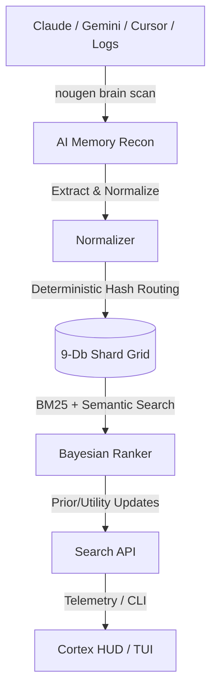

# 🪩 NouGenShards

```text
┌┐╷┌─┐╷ ╷┌─╴┌─╴┌┐╷┌─┐╷ ╷┌─┐┌─┐╶┬┐┌─┐
│└┤│ ││ ││╶┐├╴ │└┤└─┐├─┤├─┤├┬┘ ││└─┐
╵ ╵└─┘└─┘└─┘└─╴╵ ╵└─┘╵ ╵╵ ╵╵└╴╶┴┘└─┘
```

**NouGenShards gives AI assistants persistent local memory — so your best fixes, decisions, and context don't disappear between tools.**

> **"Nou Gen"** means *"We have"* in Haitian Creole. NouGenShards means: **We have memory.**
> 🇭🇹 Built by **Who Visions** to empower global diaspora intelligence.

Every AI tool you use forgets when the session ends. NouGenShards scans your machine for scattered AI traces — Claude, Gemini, Cursor, Codex, and more — extracts the useful context, and stores it locally in encrypted SQLite databases you control. No cloud required.

> ⚠️ **Source-Available, Not Open Source**: This project is provided so users can inspect, learn, and trust the local client. Commercial reuse, redistribution for a fee, and competing hosted services are strictly prohibited. See [LICENSE.md](./LICENSE.md).

---

## 📖 CLI Workflow Example

```bash
# 1. Discover and import scattered AI history from Claude, Gemini, Cursor, etc.
$ nougen brain scan
Found:
✓ Claude (3,412 items)
✓ Gemini (1,209 items)
✓ Cursor (4,891 items)

# 2. Search your memory substrate semantically
$ nougen search "React auth bug" --semantic
[Shard #142] (8 months ago via Claude)
"Fixed JWT token expiration handler..."
```

---

## 🏗️ Architecture



---

## 🚀 Why NouGenShards?

- **AI Memory Recon**: Run `nougen brain scan` to discover and import your fragmented AI history across 15+ known tool formats.
- **Cortex HUD**: See your memory grow — a 3x3 substrate map, high-velocity timelines, and a point-and-click shard browser. Ships as a native desktop app (Tauri) and web view.
- **Privacy First**: Your core memory stays on your machine in local SQLite databases. Secrets are redacted on import, and the credential vault encrypts values at rest. Cloud platforms forget, but local memory belongs to you.
- **Bayesian Ranking**: The tool learns what is useful. Marking a shard as helpful improves future search relevance automatically.
- **Federated Intelligence**: Search your local shards, your production SQL databases, and remote cloud nodes simultaneously.
- **Parametric Dreams** *(experimental)*: The engine consolidates knowledge via Bayesian decay and exports distilled SFT datasets (TMEM) for fast-weight LoRA updates. Dataset export is real; the weight-update step is simulated scaffolding today.
- **Production Ready**: Built-in OpenRouter routing with automatic fallback and response healing.
- **[Deep Architecture →](docs/architecture.md)**: The full 21-step Metameric Memory Engine blueprint.

---

## 📦 Quick Start

### 1. Install

**Windows (One-Click)** 🪟
```bash
# Just run the launcher
nougen.bat
```

**Other Platforms** 🐍🟢
```bash
# Using Python
pip install .
```

### 1b. Desktop HUD (Tauri)

The Cortex HUD also ships as a native desktop app (Rust + Tauri v2, React frontend):

```bash
npm install          # frontend deps
npm run tauri dev    # live-reload development window
npm run tauri build  # production app at src-tauri/target/release/
```

Prerequisites: Node 20+, Rust toolchain (`winget install Rustlang.Rustup`), and
`npm i -g @tauri-apps/cli`. On first checkout run `tauri icon src-tauri/icons/icon.png`
to regenerate the platform icon binaries (they are not committed).
The HUD talks to the Python engine through Tauri commands (`search_shards`,
`engine_status`, `memory_stats`) that proxy the `nougen … --json` CLI contract.

### 2. Find Your AI Brain

```bash
# Discover local AI tool history
nougen brain scan

# Import history into your local memory (dry-run by default)
nougen brain import

# Write to the database
nougen brain import --confirm
```

### 3. Check Health

```bash
nougen doctor
```

---

## 💾 Core Workflow

### Capture Experience
```bash
nougen add "Fixed the N+1 query bug in the user controller" --tags rails,fix,performance
```

### Search Memory
```bash
nougen search "N+1 query" --semantic
```

### Close the Loop
```bash
# Tell the tool Shard #5 was helpful to update its Bayesian utility score
nougen mark 5 --worked
```

### Agent Handoffs
Leave a structured note for the next coding agent when you transfer work between
sessions (Gemini, Claude, Codex, local models). Captures the goal, git state,
open tasks, and a free-text note. See **[docs/handoffs.md](docs/handoffs.md)** for
the full protocol, schema, and environment overrides.
```bash
# Outgoing agent records where it left off
nougen handoff create --goal "Wire the Tauri sidecar" --message "frontend done, rust stubbed"

# Incoming agent reviews the latest open handoff...
nougen handoff read

# ...then acknowledges it (the read-back that marks it picked up)
nougen handoff ack --message "picking this up"

# See history and which handoffs are still open
nougen handoff list
```

---

## ☁️ Cloud & Hybrid Modes

NouGenShards supports three ways to use cloud intelligence:

1.  **Local (Free)**: Use Ollama or LM Studio on your own machine.
2.  **BYOK (Bring Your Own Key)**: Connect your own OpenAI, Anthropic, or OpenRouter keys.
3.  **Who Visions Cloud (Pro)**: Access our hosted resilient brain with metered billing and managed sync.

See [Cloud Modes](./docs/cloud-modes.md) and [Licensing](./docs/licensing.md) for details.

---

## 🧩 Extension Boundaries

To protect Who Visions' intellectual property, this repository contains the **Public Client**. High-value intelligence features are maintained in private modules:

- **Public Client**: CLI, local memory, BYOK adapters, AI Memory Recon, and plugin interfaces.
- **Private Brain**: Proprietary ranking formulas, agent orchestration recipes, and cost optimizers.
- **Paid API**: Hosted model gateway and global synchronization.

---

## 🥇 Standards

- ✅ 100% Pass Rate on 121+ unit tests.
- 💻 Hardened for Windows, macOS, and Linux.

## 📜 Notice

Copyright © 2026 Who Visions LLC. All rights reserved. 🛡️ This source code is provided for visibility and personal use only. Commercial reuse is not granted.
