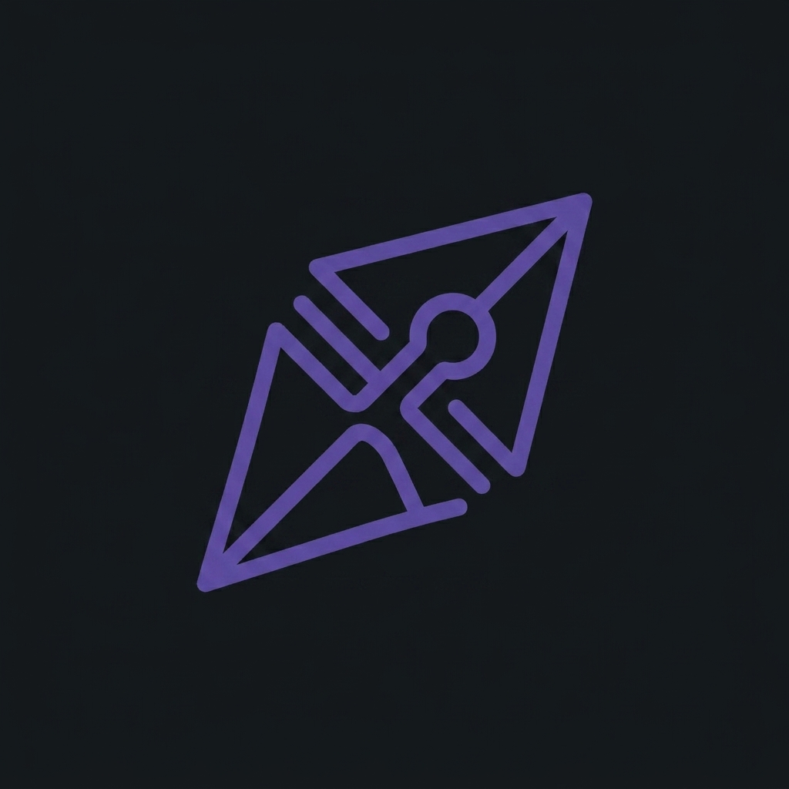
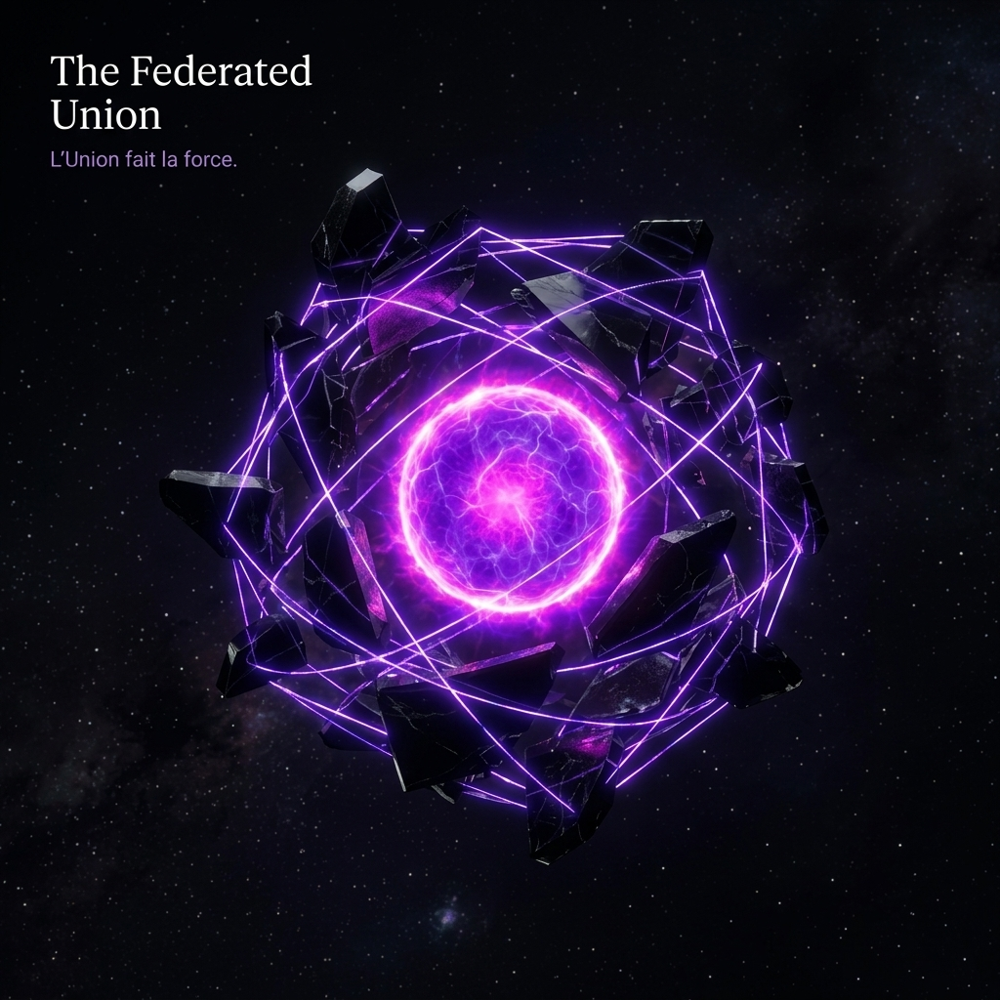
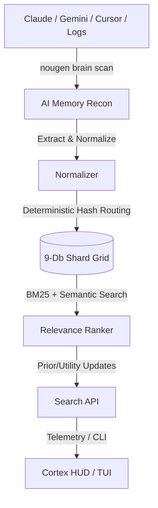
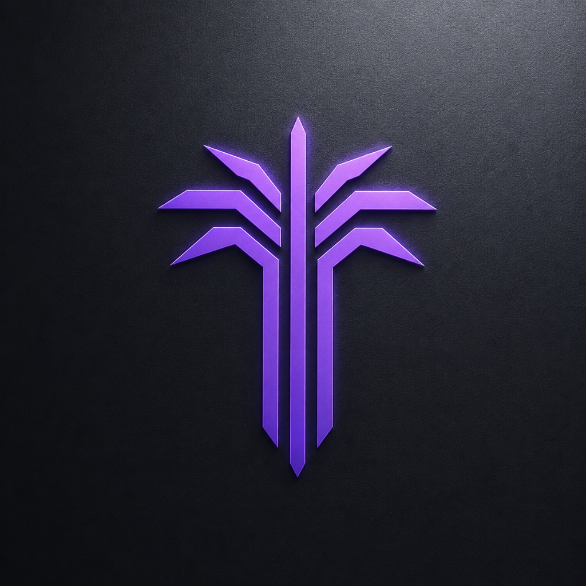
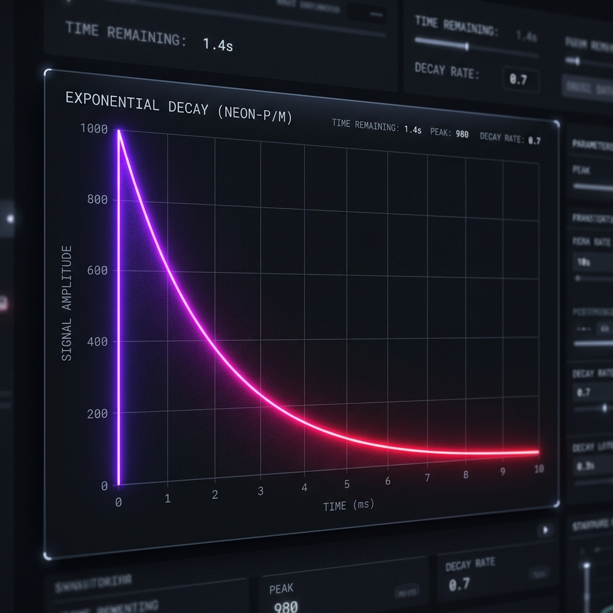
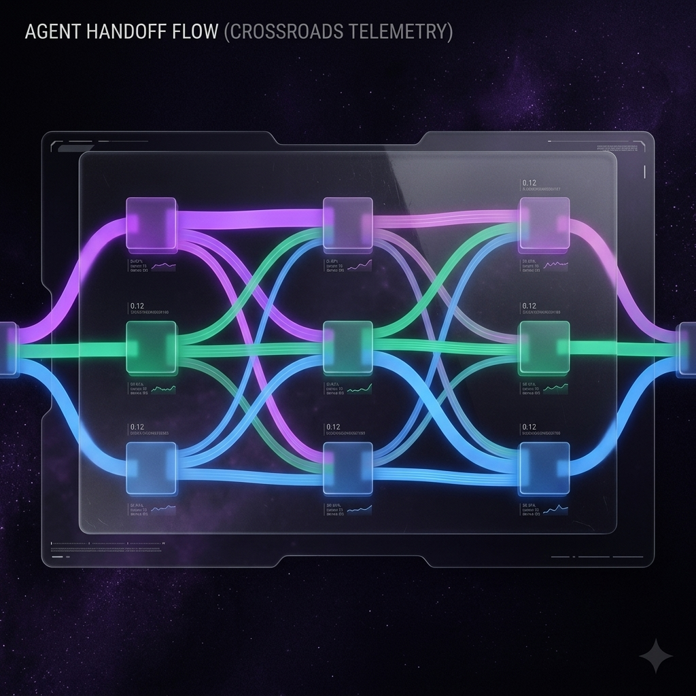
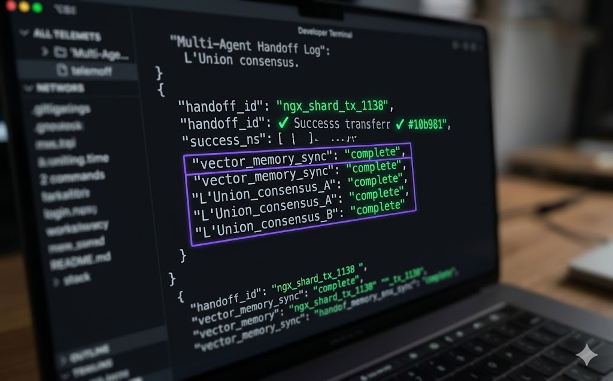

<p align="center">
  <picture>
    <source media="(prefers-color-scheme: dark)" srcset="docs/images/logo_dark.png">
    <source media="(prefers-color-scheme: light)" srcset="docs/images/logo_light.png">
    
  </picture>
</p>

<h1 align="center">🪩 NouGenShards</h1>

<p align="center">
  <strong>Persistent local memory for AI assistants — so your best fixes, decisions, and context don't disappear between tools.</strong>
</p>

<p align="center">
  <picture>
    <source media="(prefers-color-scheme: dark)" srcset="docs/images/federated_union_dark.png">
    <source media="(prefers-color-scheme: light)" srcset="docs/images/federated_union_light.png">
    
  </picture>
</p>

> **"Nou Gen"** means *"We have"* in Haitian Creole. NouGenShards means: **We have memory.**
> 🇭🇹 Built by **Who Visions** to empower global diaspora intelligence.

Every AI tool you use forgets when the session ends. NouGenShards scans your machine for scattered AI traces — Claude, Gemini, Cursor, Codex, and more — extracts the useful context, and stores it locally in encrypted SQLite databases you control. No cloud required.

> ⚠️ **Source-Available, Not Open Source**: This project is provided so users can inspect, learn, and trust the local client. Commercial reuse, redistribution for a fee, and competing hosted services are strictly prohibited. See [LICENSE.md](./LICENSE.md).

---

## 📖 CLI Workflow Example

```bash
# 1. Discover and import scattered AI history from Claude, Gemini, Cursor, etc.
$ nougen brain scan
Found:
✓ Claude (3,412 items)
✓ Gemini (1,209 items)
✓ Cursor (4,891 items)

# 2. Search your memory substrate semantically
$ nougen search "React auth bug" --semantic
[Shard #142] (8 months ago via Claude)
"Fixed JWT token expiration handler..."
```

---

## 🏗️ Architecture


```mermaid
graph TD
    A[Claude / Gemini / Cursor / Logs] -->|nougen brain scan| B[AI Memory Recon]
    B -->|Extract & Normalize| C[Normalizer]
    C -->|Deterministic Hash Routing| D[(9-Db Shard Grid)]
    D -->|BM25 + Semantic Search| E[Relevance Ranker]
    E -->|Prior/Utility Updates| F[Search API]
    F -->|Telemetry / CLI| G[Cortex HUD / TUI]
```

---

## 🚀 Why NouGenShards?

<p align="center">
  <picture>
    <source media="(prefers-color-scheme: dark)" srcset="docs/images/palmis_logo_dark.jpg">
    <source media="(prefers-color-scheme: light)" srcset="docs/images/palmis_logo_light.png">
    
  </picture>
</p>

- **AI Memory Recon**: Run `nougen brain scan` to discover and import your fragmented AI history across 15+ known tool formats.
- **Cortex HUD**: See your memory grow — a 3x3 substrate map, high-velocity timelines, and a point-and-click shard browser. Ships as a native desktop app (Tauri) and web view.
- **Privacy First**: Your core memory stays on your machine in local SQLite databases. Secrets are redacted on import, and the credential vault encrypts values at rest. Cloud platforms forget, but local memory belongs to you.
- **Relevance ranking that learns**: Mark a shard as helpful and it ranks higher next time. Results are scored by a weighted blend of keyword match (BM25), semantic similarity, and your usefulness votes.

<p align="center">
  <picture>
    <source media="(prefers-color-scheme: dark)" srcset="docs/images/decay_curve_dark.png">
    <source media="(prefers-color-scheme: light)" srcset="docs/images/decay_curve_light.png">
    
  </picture>
</p>

- **One search across sources**: Search your local memory and any cloud nodes you connect. Results are merged into one ranked list.
- **Memory consolidation** *(experimental)*: The engine ages out stale memory over time so the most useful context stays on top.
- **Bring your own provider**: Route requests through OpenRouter with automatic fallback if a model is unavailable.
- **[How it works](docs/architecture.md)**: How the memory engine maps onto the code.

---

## 📦 Quick Start

### 1. Install

One command takes a fresh clone to a working state — it creates the virtualenv,
installs the project, verifies the CLI, and reports which credentials are
unconfigured without ever reading their values:

```bash
python tools/bootstrap.py
```

`--check` verifies without changing anything; `--json` emits a report CI can gate
on. It is stdlib-only by design, because it has to run before anything is
installed.

**Windows (One-Click)** 🖥️
```bash
# Just run the launcher
nougen.bat
```

**Other Platforms** 🐍🟢
```bash
# Using Python
pip install .
```

### 1b. Desktop HUD (Tauri)

The Cortex HUD also ships as a native desktop app (Rust + Tauri v2, React frontend):

```bash
npm install          # frontend deps
npm run tauri dev    # live-reload development window
npm run tauri build  # production app at src-tauri/target/release/
```

Prerequisites: Node 20+, Rust toolchain (`winget install Rustlang.Rustup`), and
`npm i -g @tauri-apps/cli`. On first checkout run `tauri icon src-tauri/icons/icon.png`
to regenerate the platform icon binaries (they are not committed).
The HUD talks to the Python engine through Tauri commands (`search_shards`,
`engine_status`, `memory_stats`) that proxy the `nougen … --json` CLI contract.

### 2. Find Your AI Brain

```bash
# Discover local AI tool history
nougen brain scan

# Import history into your local memory (dry-run by default)
nougen brain import

# Write to the database
nougen brain import --confirm
```

### 3. Check Health

```bash
nougen doctor
```

---

## 💾 Core Workflow

### Capture Experience
```bash
nougen add "Fixed the N+1 query bug in the user controller" --tags rails,fix,performance
```

### Search Memory
```bash
nougen search "N+1 query" --semantic
```

### Close the Loop
```bash
# Tell the tool Shard #5 was helpful so it ranks higher next time
nougen mark 5 --worked
```

### Agent Handoffs

<p align="center">
  
</p>

Leave a structured note for the next coding agent when you transfer work between
sessions (Gemini, Claude, Codex, local models). Captures the goal, git state,
open tasks, and a free-text note. See **[docs/handoffs.md](docs/handoffs.md)** for
the full protocol, schema, and environment overrides.
```bash
# Outgoing agent records where it left off
nougen handoff create --goal "Wire the Tauri sidecar" --message "frontend done, rust stubbed"

# Incoming agent reviews the latest open handoff...
nougen handoff read

# ...then acknowledges it (the read-back that marks it picked up)
nougen handoff ack --message "picking this up"

# See history and which handoffs are still open
nougen handoff list
```

<p align="center">
  
</p>

---

## 🤖 Fleet Agent Roster

NouGenShards features a 10-agent roster (personas layered over the memory engine). They execute on local models by default, at $0:

- **Sharder**: Ingestion (Data Capture & Indexing).
- **Remember**: Recall (Memory Retrieval & Verification).
- **Kronos**: Time (Temporal Grounding & Decay).
- **DavOs**: Operations (Oversight & Gatekeeper).
- **Sol-Ai**: Broad Reasoning & Illumination.
- **NouGen**: Orchestrator (Core Orchestration & Branding).
- **Griot**: Rules (Semantic Synthesis & Consolidation).
- **Rhea**: Security (System Hardening & Audit).
- **Kaedra**: Pedagogy (Tensor Mathematics & Training).
- **Iris**: Airspace (Web Research & Browser Actuation).

These are **roles, not separate model downloads**. They ride the resident local model (`gemma4:e2b-qat`) as system prompts; the Modelfiles under `fleet/` are the source of truth for each persona's charter. Earlier revisions of this list named per-persona tags such as `iris-ai:e4b` and `sol-ai:e4b` — those tags no longer exist, and full-fat persona builds do not fit a 6 GB card, so the VRAM gate reroutes them by design.

Routing prefers the local lane, then free lanes. If no lane is available the run **reports that** rather than silently escalating to a metered provider — see the capability-layer section below.

---

## 🧭 NouGen is a capability layer, not an inference provider

NouGen runs on infrastructure **you already own**: your API accounts, your local
GPU, your repositories and storage. It supplies orchestration, memory, a handoff
baton, and routing policy. It holds no model of its own and resells no inference.

That is a design constraint, not a disclaimer, and it decides real behaviour:

- **Credentials are deployment configuration, never build inputs.** A clean clone
  must build, import and pass its tests with zero credentials present. Anything
  that fails without a key is misfiled. `tools/bootstrap.py` enforces this, and
  `tests/test_repro_smoke.py` keeps it enforced.
- **Capability discovery, not provider assumption.** What is available is
  *detected* at run time — which local models are resident, which accounts
  answer, which endpoints are reachable — rather than assumed from a fixed
  vendor. A 6 GB card and a 24 GB card get different routes from the same code.
- **$0 lanes come first.** Local Ollama, then free lanes, then anything metered.
- **An unavailable lane is reported, never silently escalated to a paid one.**
  Refusal is a route. Discovering a paid fallback in a bill is not.
- **Memory and coordination are yours too.** Shards are the knowledge substrate;
  the relay is the handoff baton between machines. Both live on your storage.

The practical test: if NouGen disappeared tomorrow, every account, model, shard
and repository it touched would still be yours, exactly where it already was.


## ☁️ Cloud & Hybrid Modes

NouGenShards supports three ways to use cloud intelligence:

1.  **Local (Free)**: Use Ollama or LM Studio on your own machine.
2.  **BYOK (Bring Your Own Key)**: Connect your own OpenAI, Anthropic, or OpenRouter keys.
3.  **Who Visions Cloud (Pro)**: Access our hosted resilient brain with metered billing and managed sync.

See [Cloud Modes](./docs/cloud-modes.md) and [Licensing](./docs/licensing.md) for details.

---

## 🧩 What's in this repo

This repository is the public client: the CLI, the local memory engine, bring-your-own-key adapters, AI Memory Recon, and the plugin interfaces. Some hosted and advanced features are not part of this repository.

### 🎯 Skills

`skills/` holds standing instructions the agent must follow for a kind of work. They are
**not optional**: when a skill covers the task, it supersedes the model's own defaults.
The MCP server hands its client the roster on connection, and `apply_skills(task)` returns
every governing skill in full — one call, no list-then-load step.

Shipping now: **`skills/design/`**, which authors and audits design systems as portable
[`DESIGN.md`](skills/design/SKILL.md) packages, with a validator enforcing contrast,
focus-visible, theme-scope and dual-canon gates. Start a new system from
`skills/design/brands/_template/`.

See [`skills/README.md`](skills/README.md) for the layout and how to write one.

---

## 🥇 Standards

- ✅ 100% pass rate on 460+ unit tests.
- 💻 Hardened for Windows, macOS, and Linux.

## 📜 Notice

Copyright © 2020–present Who Visions LLC. All rights reserved. 🛡️ This source code is provided for visibility and personal use only. Commercial reuse is not granted.
