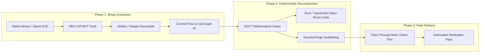

# NouGenMorph: The AI Unlock Has Begun — Game Modding, Binary Decompilation & Autonomous Porting

**Source**: AI Search (`@theAIsearch`)  
**Title**: *"The AI unlock has begun"*  
**URL**: https://youtu.be/h5zkzon0gM4 (`tube:h5zkzon0gM4`)  
**Upload Date**: 2026-10-06 | **Duration**: 14m29s  
**Channel**: AI Search (753K subscribers)  
**Target Fleet Modules**: NouGenForge, REA (`morluto/rea`), UDCT Engine, Reverse Engineering MCP Toolsets  

---

## 1. Tactical Intelligence & Video Breakdown

The video documents a historical inflection point in autonomous software engineering: **agents shifting from writing greenfield web-apps to deconstructing, modding, decompiling, and porting closed-source game engines and native compiled binaries**.

### Core Chapters & Milestones:
1. **0:00 - Intro & The Inflection Point**:
   - AI models (specifically Claude 3.5 Sonnet / Opus class models paired with specialized MCP tools) are now breaching closed binary barriers.
   - Modding, once locked behind years of specialized reverse engineering expertise, is becoming accessible through agentic orchestration.
2. **0:55 - Reverse Engineering Binaries**:
   - Inspecting compiled binaries without source code.
   - Decompilation via Ghidra, IDA Pro, Hopper, and ILSpy.
   - Recovering memory structures, function tables, and logic trees directly into agent context.
3. **3:34 - Pass-Through Modding Architecture**:
   - Intercepting game engine calls in memory or at the API boundary without altering core binaries.
   - Hooking DirectX/Vulkan render passes, game state loops, and network packets.
4. **5:40 - The REA Connection (`morluto/rea`)**:
   - Explicitly cites `morluto/rea` (Reverse Engineer Anything) as the agent-native bridge connecting LLMs directly to decompilation tools (Hopper, Ghidra, CDP).
5. **7:49 - Rebuilding in Rust & Memory Safety**:
   - Taking decompiled C/C++ game routines and cleanly reimplementing them in safe, performant Rust.
   - Eliminating buffer overflows and legacy memory vulnerabilities while maintaining byte-for-byte behavioral parity.
6. **9:06 - Platform Compatibility & Porting Mechanics**:
   - Porting closed console logic (e.g. AnyPS5, PortPS5) and PC binaries to new platforms (macOS, Linux, WebAssembly).
7. **11:50 - Prompting for Decompilation & Reverse Engineering**:
   - Structuring prompts around call graphs, control flow reconstruction, and symbol matching rather than asking models to blindly hallucinate source code.
8. **12:31 - Cracking vs Fair Use Modding**:
   - The double-edged sword of binary recovery: security circumvention versus interoperability, preservation, and gameplay modification.
9. **13:08 - The Autonomous Future**:
   - Game engines become fluid software. Any feature, render technique, or physics mechanic from an existing title can be extracted, analyzed, and synthesized into new projects.

---

## 2. Cited Ecosystem Repositories & Tool Matrix

| Repository | Focus & Domain | Fleet Status |
| :--- | :--- | :--- |
| **`morluto/rea`** | Reverse engineer anything with agents (CLI + MCP + Hopper/Ghidra) | **Absorbed** in `C:\Users\super\Outpost\rea` + MCP registered |
| **`rehan-remade/universal-modder`** | Universal AI game modder harness | Under evaluation |
| **`trevaintdead/ai-game-modding-guides`**| Prompt patterns & workflow guides for AI modding | Sharded into memory |
| **`bethington/ghidra-mcp`** | Ghidra Model Context Protocol bridge | Aligned with REA Ghidra adapter |
| **`HexRaysSA/ida-mcp`** | IDA Pro MCP plugin | Documented |
| **`icsharpcode/ilspy`** | .NET Decompiler engine | Supported via REA managed-code engine |
| **`SamboyCoding/Cpp2IL`** | Unity/Il2Cpp reverse engineering | Critical for Unity game modding |
| **`boykopovar/AnyPS5` / `yuriolive/PortPS5`**| Next-gen console binary emulation & porting | Specialized runtime research |

---

## 3. NouGen Architectural Synthesis & UDCT Alignment

### Invariant 1: No "Vibe" Modding (Evidence-Based Reversal)
- Models must not invent reverse-engineered logic.
- Decompilation must feed directly into formal call graphs and cross-references (`xrefs`) captured in canonical Evidence bundles (`evidence-export`).

### Invariant 2: The Clean-Room Reconstruction Bridge (`REA` $\to$ `NouGenForge`)
- **REA** extracts the behavioral footprint and assembly/CIL evidence.
- **NouGenForge** (`forge_scaffold`) takes the recovered intermediate representation (IR) and deterministically renders the safe Rust or TypeScript reimplementation.

---

## 4. Fleet Action Items
1. ✅ **REA Sharding & Deployment**: Completed with 118 MCP tools and skill.
2. ✅ **NouGenForge Scaffolding**: Initialized at `C:\Users\super\Outpost\NouGenForge`.
3. 🔄 **Unity/IL2CPP Support**: Benchmark `Cpp2IL` integration with `rea` for automated Unity game asset extraction.
