# NouGenMorph: Neurobiology of Memory Consolidation & Cognitive Shard Consolidation

**Source**: Kurzgesagt – In a Nutshell — *"How Are Memories Stored Inside Your Brain?"*  
**URL**: https://youtu.be/PqtggjVAi8M (`tube:PqtggjVAi8M`)  
**Capture Shard**: `30693@db2` (Captured: 2026-10-05)  
**Duration**: 11m12s  
**Target Fleet Modules**: NouGen Memory Substrate (FTS5 / WAL / Layered Recall), Cortex & Dream Engine, Episodic-to-Semantic Promotion, Handoff Replay

---

## 1. Biological Intelligence & Cognitive Forensics

Kurzgesagt details the biological physics and electrochemical architecture of human memory formation, consolidation, and reconsolidation:

```
[Sensory Input / Cortex Columns] ──(Synchronous Firing)──> [Transient Assembly]
                                                                   │
                                                                   ▼
[Hippocampus Blueprint Index] <──(Chemical Bath & Synapse Plasticity)──┘
        │
        ├──(Without Sleep / Reinforcement)──> Synaptic Pruning / Complete Erasure
        │
        └──(Sleep Replay & Consolidation)───> [Structural Cortex Synaptic Growth]
                                                        │
                                                        ▼ (Cue Retrieval)
                                              [Plastic Reconsolidation State]
                                              (Context updates & lore rewrites)
```

### A. The Cortical Foundation (86 Billion Neurons & 100 Trillion Synapses)
- **Cortical Columns**: The cortex is organized into micro-columns of dozens to thousands of neurons acting as localized information-processing units (visual columns, auditory frequency columns, language decoders, somatic feedback).
- **The Assembly Principle**: Experience is not a single file on a disk. It is a distributed **Assembly** of disparate cortical columns firing in temporal synchrony.
- **Synaptic Plasticity ("Neurons that fire together, wire together")**: Simultaneous firing bathes synapses in neuromodulators, altering receptor density and reducing transmission resistance.

### B. The Hippocampus (The Dynamic Blueprint Indexer)
- The cortex cannot permanently wire an assembly instantly without causing catastrophic interference or brain-wide seizures.
- **The Hippocampus Role**: Operates as the **Master Indexer & Librarian**. It creates a lightweight spatial-temporal **Blueprint** of which cortical columns fired together.
- **Fragile State**: A nascent memory is fragile. Without reinforcement, synaptic weights decay rapidly, and the blueprint is pruned (why mundane sensations—like coffee from 43 weeks ago—evaporate).

### C. Sleep Consolidation (The "Dream" Engine)
- **Offline Assembly Replay**: During slow-wave and REM sleep, the hippocampus replays the day's winning assemblies at high speed.
- **Structural Transformation**: Synapses literally grow physical micro-structures ("teeth on biological gears"), permanently transferring distributed memory storage from transient hippocampal indices into permanent cortical architecture.

### D. Reconsolidation & The Narrative Rewrite
- **Recall Makes Memory Plastic**: Every time an assembly is cued (by a smell, word, or image), the neurons re-enter a chemically labile, plastic state.
- **Contextual Injection**: The current context, emotional state, and expectations seep into the original assembly. Synapses re-weight; details are pruned, exaggerated, or updated to fit the present life narrative.
- **"Your brain updates your past life to fit the narrative of your present life."**

---

## 2. NouGen Architectural Morph: Biological Memory vs. The 9-DB Grid

The biological mechanics of cortical assemblies and hippocampal indexing map 1:1 to the **NouGen Memory Hierarchy**:

| Biological Memory System | NouGen Architecture Equivalent | File / Module Target |
| :--- | :--- | :--- |
| **Cortical Sensory Input** | Raw Telemetry, CLI stdout, Tool logs, Diff output | Transient context / NouGen Sandbox |
| **Transient Assembly** | Local L1 Session Context (SQLite WAL FTS5) | `~/.nougen/shards/context/session.db` |
| **Hippocampal Blueprint Index** | Dedicated FTS5 Inverted Index & Match Tables | `nougen_shards_*.db` (Virtual FTS5 tables) |
| **Sleep Assembly Replay** | **Dream Engine / Cortex Batch Consolidation** | `persistence/Cortex.py` & `tools/dream_digest.py` |
| **Permanent Cortical Wiring** | System 2 Semantic Invariants (Promoted Shards) | `core.py` (`retrieve_dual_system`, System 2) |
| **Reconsolidation & Lore Rewrite** | Handoff Checkpoints & Dynamic Context Elevation | `.handoffs/` & `promote_context_to_shard` |

---

## 3. The 4 Engineering Invariants for Machine Longevity

```mermaid
graph TD
    subgraph Biological_Brain [Human Neural Mechanics]
        Sensory["Sensory Influx (Cortex)"] --> HippocampalIndex["Hippocampus Blueprint"]
        HippocampalIndex --> SleepConsolidation["Sleep Replay (Structural Wiring)"]
        SleepConsolidation --> PlasticRecall["Cue Recall (Reconsolidation & Lore Rewrite)"]
    end

    subgraph NouGen_Mesh [NouGen Multi-Tier Substrate]
        RawStream["Raw Terminal / IPC Stream"] --> SessionWAL["L1: SQLite WAL session.db"]
        SessionWAL --> DreamEngine["Cortex Dream Replay & Epistemic Filter"]
        DreamEngine --> FTS5Grid["L2: 9-DB FTS5 Shard Grid (279k+ Records)"]
        FTS5Grid --> Reconsolidate["Layered Recall & Dynamic Context Promotion"]
    end
```



### Invariant 1: Separation of Ingestion from Permanent Wiring
- **Biological Principle**: The brain never commits live sensory fire directly into permanent cortical structures; doing so causes seizures and memory corruption.
- **NouGen Clamp**:
  - Live session telemetry writes strictly to **L1 SQLite WAL (`session.db`)**.
  - Raw uncurated stdout is never dumped straight into core permanent memory shards. It must pass through the epistemic filter.

### Invariant 2: High-Speed Blueprint Retrieval (<50ms)
- **Biological Principle**: The hippocampus does not store all sensory raw data; it stores the wiring blueprint to re-ignite the cortical assembly.
- **NouGen Clamp**:
  - We do not store bloated 100k-token blobs.
  - NouGen uses compact, era-stamped records (`~30k` chars max) indexed via FTS5 with BM25 ranking. Retrieval is sub-50ms, reigniting the exact architectural state with minimal token footprint.

### Invariant 3: Offline Consolidation ("Sleep / Dream" Engine)
- **Biological Principle**: Memories become solid long-term assets only through offline replay and pruning during sleep.
- **NouGen Clamp**:
  - Implemented in `persistence/Cortex.py` and `tools/dream_digest.py`.
  - Overnight batch consolidation groups transient session handoffs, prunes noisy error traces, derives semantic invariants, and writes permanent shards into the 9-DB grid.

### Invariant 4: Controlled Reconsolidation (No Silent Drift)
- **Biological Principle**: Retrieval renders memory plastic and prone to confabulation or lore drift.
- **NouGen Clamp**:
  - In biological brains, reconsolidation can cause false memories.
  - In NouGen, we prevent memory corruption via **Cryptographic Domain-Separated Hash Descriptors** ([src/nougen_shards/rsi_artifact_identity.py](file:///C:/Users/super/Outpost/NouGen/src/nougen_shards/rsi_artifact_identity.py)).
  - While context and metadata evolve, raw canonical artifacts remain cryptographically verifiable and tamper-proof.

---

## 4. Fleet Ingestion & Canon Record
- **Canon Document**: [docs/morph-scope-kurzgesagt-brain-memory.md](file:///C:/Users/super/Outpost/NouGen/docs/morph-scope-kurzgesagt-brain-memory.md)
- **Primary Tags**: `#morph #neurobiology #memory-consolidation #hippocampus #cortex #dream-engine #fts5 #shards`
