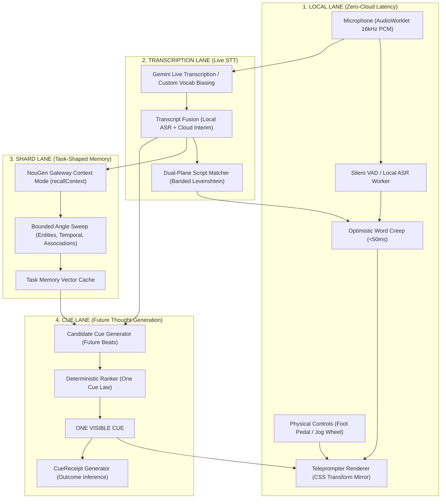

# 🟣 NouGenQ: Master Architecture & Production Blueprint

> **Canonical System Specification & Google AI Studio Master Build Guide**  
> **Authority:** `~/.nougen` | **Version:** 2.0.0  
> **Target Platforms:** Google AI Studio Build Mode, Next.js / Cloudflare Workers, Desktop PWA, Standalone Teleprompter Glass

---

## 1. Executive Philosophy & System Mission

**NouGenQ is not a chatbot. It is not an AI writing assistant. It is not merely a scrolling teleprompter.**  
NouGenQ is a local-first, memory-aware, autonomous live prompting system designed to keep the speaker's **next useful thought** directly under their mouth.

### The Governing Loop
$$\text{LIVE SPEECH} \longrightarrow \text{TRANSCRIPTION} \longrightarrow \text{CONTEXT BUFFER} \longrightarrow \text{SHARDS RETRIEVAL} \longrightarrow \text{BEAT GENERATION} \longrightarrow \text{DETERMINISTIC RANKER} \longrightarrow \mathbf{\text{ONE VISIBLE CUE}} \longrightarrow \text{SPEAKER RESPONSE} \longrightarrow \text{CUE RECEIPT \& RETIREMENT}$$

---

## 2. Process Donor Synthesis Matrix

| Donor Source | Extracted Mechanism / Process | NouGenQ Native Architecture |
|---|---|---|
| **ScriptFox** | Speech-following tracking, pause detection, off-script tangent tolerance, resync, vocabulary calibration | `PhoneticScriptAnchor` & `FuzzySpeechTracker` |
| **CuePrompter** | Zero-friction immediacy, giant readable typography, high-contrast themes, mirror flip, no account setup | `Q Zero Bootstrap` & `OpticalMirrorProfile` |
| **VIDEOENGINEERING** | Broadcast resilience, operator console, manual authority override, offline PWA, live doc hot-reloading | `FailoverMesh`, `OperatorAirGate`, & `LiveDocumentAdapter` |
| **PromptMe AI** | AudioWorklet 16kHz PCM, Silero VAD, Double Metaphone + banded Levenshtein distance, optimistic word creep (85% WPM) | `AudioRingBuffer`, `OptimisticWordCreep`, & `ASRConfusionLexicon` |
| **StackExchange / Recs** | Multi-speaker color-coding, physical foot-pedals/GPIO/HID/StreamDeck, sightline geometry ($\theta = \text{atan}(\frac{\text{offset}}{\text{distance}})$), eye travel budget | `SpeakerTallyBus`, `PhysicalControlAdapter`, & `SightlineCalibrator` |
| **BetterDisplay / Elgato** | External display leasing, `DisplayEndpoint` lifecycle, headless canvas buffer, anti-flapping protection, render receipts | `DisplayEndpointSentry`, `HeadlessCanvasBuffer`, & `RenderReceipt` |
| **jlecomte Voice Prompter** | Dual script planes (`DISPLAY_PLANE` vs `SPEECH_PLANE`), bracketed hint stripping (`[PAUSE 2s]`, `[CAMERA 2 CUT]`), click-any-word absolute authority re-anchor | `DualPlaneScriptAST` & `ManualWordReanchor` |
| **Imaginary Teleprompter** | Motion grammar (confirmed anchor vs target visual position vs smoothed screen velocity), focus zones (focus masks), marker shortcuts, draft/active revision migration, segment timer context integration | `MotionController`, `FocusZoneHUD`, `RevisionMigrationEngine`, & `SegmentTimerContext` |

---

## 3. Four Major Runtime Lanes

---

## 4. Architectural Invariants

### 4.1. The One Cue Law
Only **ONE** primary future cue is visible to the speaker at any given moment. Additional candidate beats remain in a shadow queue. The teleprompter never degenerates into a competing multi-card dashboard during live delivery.

### 4.2. Manual Authority Never Yields to Autonomy
If the speaker, director, or operator triggers `HOLD`, `SKIP`, `JUMP`, `BACK`, `INJECT`, or clicks any word in the script, automation yields immediately.

### 4.3. Dual-Plane Script Compilation
Authored scripts are compiled into two parallel representations:
- **`DISPLAY_PLANE`:** Rendered to talent with all directions, speaker names, pauses, and visual notes.
- **`SPEECH_PLANE`:** Stripped phonetic text consumed by speech recognition engines.

### 4.4. Two Separate Prediction Engines
1. **Reading Prediction (Local):** Predicts speaker location 300–600 ms ahead via optimistic word creep.
2. **Thought Prediction (Shards + AI):** Predicts the next high-value concept/argument the speaker should articulate.

---

## 5. Deployment & Google AI Studio Build Config

- **Frontend:** React, TypeScript, Web Audio Worklet, Tailwind / Vanilla CSS, IndexedDB PWA.
- **Backend:** Node.js, Ephemeral Gemini Live token minting, authenticated NouGen Gateway adapter.
- **Microphone Permission:** `metadata.json` configured with explicit microphone frame access.
- **GitHub Two-Way Sync:** Attached directly to `Who-Visions/NouGenQ`.
