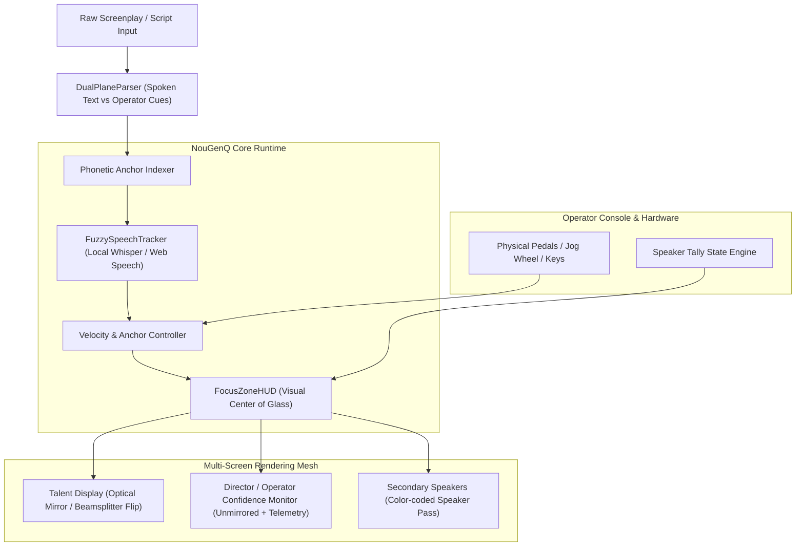

# 🎬 NouGenQ: Broadcast-Safe Teleprompter & Live Operator Engine

> **Architecture & Donor Morph Specification**
> **Fleet Authority:** `C:\Users\super\.nougen` | **Version:** 1.0.0
> **Target Substrate:** Google AI Studio / WebXR & Multi-Screen Fleet Runtime

---

## 1. Executive Summary & Design Mission

**NouGenQ** is the fleet's broadcast-grade, voice-anchored, multi-endpoint teleprompter and script execution engine. Rather than cloning monolithic third-party applications, NouGenQ synthesizes process donor patterns into a modular, highly resilient runtime capable of sub-second cutover, fuzzy speech synchronization, multi-screen tally choreography, and hardware-independent rendering.

---

## 2. Process Donor Synthesis Matrix

| Donor Source | Extracted Process / Pattern | NouGenQ Native Primitive |
|---|---|---|
| **ScriptFox & CuePrompter** | Clean-room script staging, typography scaling, fluid speed curves | `ScriptStagingEngine` & `FluidVelocityCurve` |
| **VIDEOENGINEERING** | Broadcast-safe redundancy, operator console, sub-second cutovers | `FailoverMesh` & `OperatorAirGate` |
| **promptme-ai** | Local Web Speech / Whisper fuzzy script tracking | `PhoneticScriptAnchor` & `FuzzySpeechTracker` |
| **SoftwareRecs** | Multi-speaker tally, physical pedals, beam-splitter optics | `SpeakerTallyBus` & `OpticalMirrorProfile` |
| **BetterDisplay** | DisplayLink / Elgato virtual display failover resilience | `VirtualDisplaySentry` & `HeadlessCanvasBuffer` |
| **jlecomte Voice Prompter** | Dual-plane scripts, speaker/spoken alignment, instant jump-to-cue | `DualPlaneScript` & `DirectCueAnchor` |
| **Imaginary Teleprompter** | Visual focus zones, marker revisions, per-endpoint custom styling | `FocusZoneHUD` & `LiveRevisionHotSwap` |

---

## 3. Core Architecture & Pipeline

---

## 4. Key Subsystems & Implementation Specifications

### 4.1. Dual-Plane Script Engine (`DualPlaneScript`)
Separates spoken audio targets from operator actions and director markers:
- **Spoken Plane:** Clean phonetic text consumed by speech tracking and displayed in high-legibility typography (Outfit/Inter, 48–72pt high contrast).
- **Control Plane:** Direction cues `[PAUSE 2s]`, `[CAMERA 2 CUT]`, `[GRAPHIC OVERLAY]`, `[SPEAKER: DAV3]` which update operator HUDs and trigger hardware tally without cluttering talent reading flow.

### 4.2. Phonetic Speech Anchor & Fuzzy Tracking (`FuzzySpeechTracker`)
- Employs local zero-cost speech processing (Web Speech API with fallback to local Whisper/Gemma model worker).
- Levenshtein phonetic distance matching against the active window ($\pm 15$ words).
- **Direct Re-anchor:** If the speaker improvises or skips ahead, jumping forward or backward smoothly re-anchors the scroll position in $<100\text{ ms}$ without jerking.

### 4.3. Broadcast-Safe Display Resilience (`VirtualDisplaySentry`)
- Prevents script collapse if DisplayLink, Elgato Cam Link, or external HDMI monitors disconnect.
- Renders into an offscreen `HeadlessCanvasBuffer` shared over local WebSockets / Named Pipes (`\\.\pipe\LOCAL\nougenq-stream`), ensuring reconnecting displays immediately recover current scroll state.

### 4.4. Optical Beam-Splitter Geometry (`OpticalMirrorProfile`)
- Per-endpoint CSS hardware-accelerated transforms (`transform: scaleX(-1)` vs normal).
- Adjustable eye-line focal margins to maintain direct-to-lens eye contact.

---

## 5. Fleet Integration & IPC

- **NouGenMsg Bridge:** Integrates with `NouGenMsgBus` for fleet-wide cue triggers:
  - `tools/nougenmsg.py send --target @all "Q:SCENE_START scene_04"`
  - Listens for `idle` events and state broadcasts from companion agents.
- **Relay Handoffs:** Script states and session timing logs serialize directly into `.handoffs/` for multi-machine synchronization.
